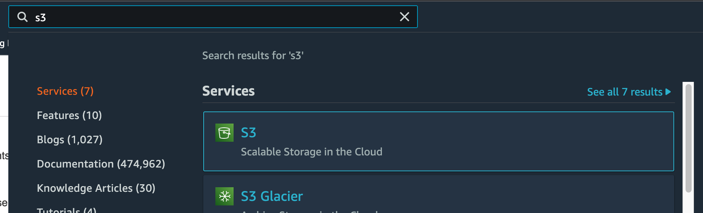
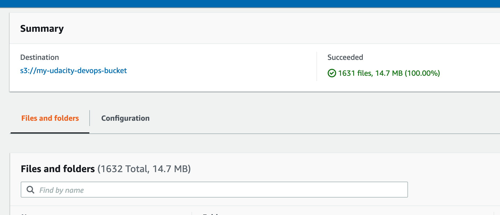

# Static website project

## S3

### Create S3 bucket

Go to S3

Check s3 (existing buckets come from CloudFormation)

Create bucket

Make public

Check Creation

### Upload files

Check upload files and folders

Check upload is successful

### Configure hosting

Go to permissions

Check bucket policy

Edit static web hosting

Check hosting is OK

## CloudFront

### Create distribution

Go to cloudfront

Create Distribution

Cache Settings

Check Distribution Creation

Get Domain Name

Check Domain

## Links

[CloudFront URL: https://doxm8flxtro2q.cloudfront.net/](https://doxm8flxtro2q.cloudfront.net/)
[S3 URL: http://my-udacity-devops-bucket.s3-website-eu-west-1.amazonaws.com](http://my-udacity-devops-bucket.s3-website-eu-west-1.amazonaws.com)